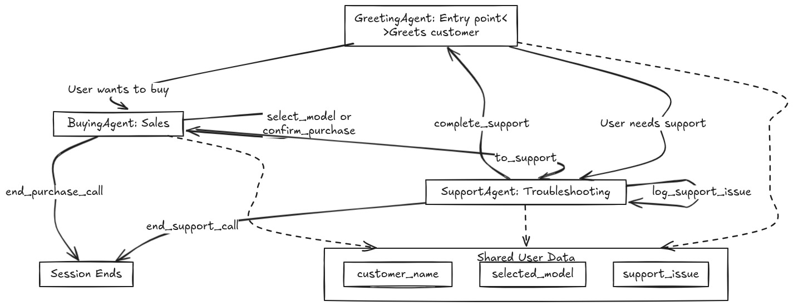

# LiveKit-Based Multi-Agent Voice Assistant System

## Overview

This system implements a multi-prompt voice assistant using **LiveKit Agents SDK**, designed to manage iPhone customer interactions. It employs modular AI agents, each handling specific conversation stages, working collaboratively to streamline **sales** and **technical support** workflows.


## To run the agent
- Setup Python venv & Activate it.
- Install all required packages, `pip install -r requirements.txt`
- Finally to talk with the Iphone agent, Run the command `python main.py console`

## Project Structure
```
LIVEKIT-MP-AGENT/
├── README.md
├── requirements.txt
├── .env
├── config.py
├── data.py
├── agents/
│   ├── __init__.py
│   ├── base.py
│   ├── greeting.py
│   ├── support.py
│   └── buying.py
└── main.py
```

## System Architecture

### 1. Core Components

- **LiveKit Agents SDK**: Manages real-time voice sessions, agent state handling, and voice interaction lifecycle.
- **Agents**:
  - **GreetingAgent** – Entry point agent greeting customers and routing calls.
  - **BuyingAgent** – Handles product selection and sales.
  - **SupportAgent** – Provides technical support and troubleshooting.
- **User Data Sharing**: All agents share a common `UserData` object for maintaining context across conversation transfers.

### 2. Shared User Data

Defined via the `UserData` dataclass:

- `customer_name`
- `selected_model`
- `support_issue`
- `agents`: Active agent registry.
- `prev_agent`: Enables partial context retention between agent switches.

### 3. Flow Control & State Transitions

Managed using:

- `AgentSession` (LiveKit SDK): Maintains active session state.
- Method calls like `to_support()`, `to_buying()`, and `_transfer_to_agent()` manage transitions.
- Conversations flow as per the flowchart, with possible loops between sales/support agents.

## Detailed Agent Roles

### GreetingAgent

- Purpose: Serves as the **entry point**.
- Actions:
  - Greets customers.
  - Uses tools (`to_support`, `to_buying`) to route to appropriate agents based on customer intent.

### SupportAgent

- Handles:
  - Troubleshooting.
  - Logging support issues via `log_support_issue()`.
  - Session termination via `end_support_call()`.
- Can route back to:
  - GreetingAgent (`complete_support()`).
  - BuyingAgent (`to_buying()`).

### BuyingAgent

- Manages:
  - Model selection (`select_model()`).
  - Purchase confirmation (`confirm_purchase()`).
  - Call closure via `end_purchase_call()`.
- Can redirect to SupportAgent if needed.

## LiveKit-Specific Technologies Used

- **AgentSession**: Central management for agent dialogue and voice streams.
- **LiveKit API**: Controls session closure (via `api.LiveKitAPI().room.delete_room()`).
- **Plugins**:
  - `deepgram` for speech-to-text (STT) and text-to-speech (TTS).
  - `silero.VAD` for voice activity detection.
  - `openai.LLM` for conversational intelligence (GPT-4.1-nano model).
- **function\_tool()**: Exposes critical functions for conversational transitions and task execution.

## Diagram Reference

The system flowchart (as shown above) visualizes:

- Conversation routes.
- Agent transitions.
- Shared data dependencies.
- Session end states.

